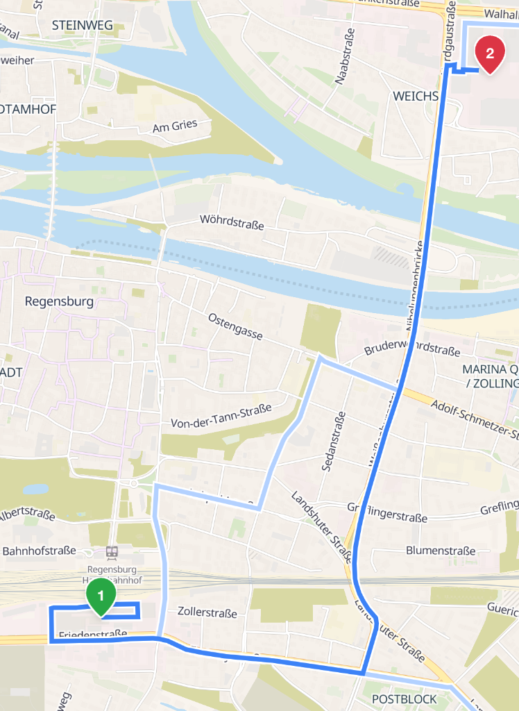
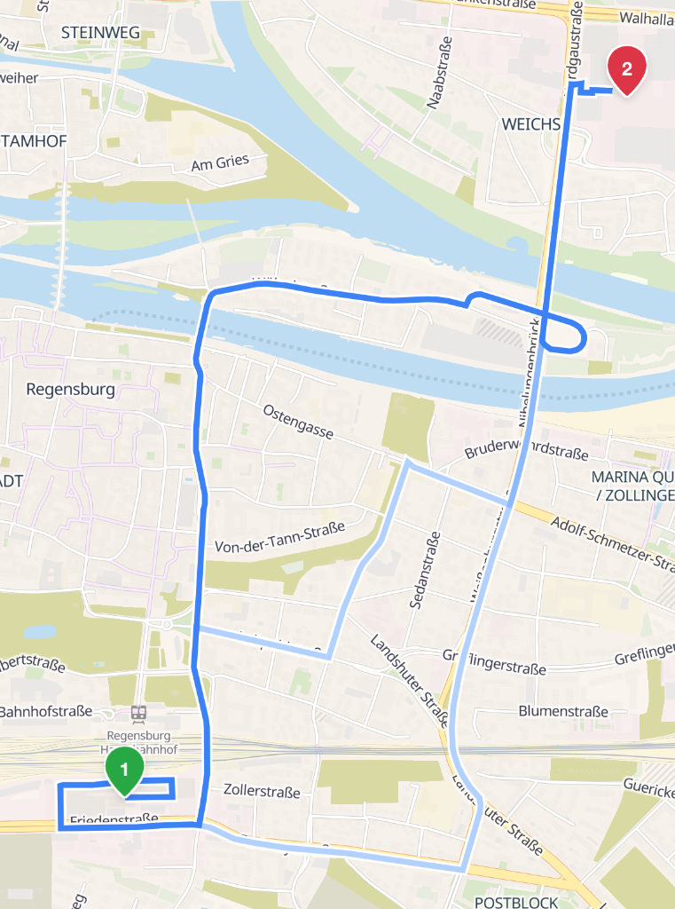

# GTFS Shape Generation Scripts

This directory contains utility scripts to process GTFS data for the Ratisbonalyzer application.

## `generate_shapes.py`

The main script `generate_shapes.py` is used to generate a GTFS `shapes.txt` file by querying a routing engine (either Valhalla or OSRM) for the road geometry between consecutive public transit stops.

### Inputs & Outputs
- **Reads**: 
  - `routes.txt`
  - `stops.txt`
  - `trips.txt`
  - `stop_times.txt`
- **Writes**: 
  - `shapes.txt` (the generated shapes file containing GPS traces)
  - `trips_with_shapes.txt` (trips mapped to their generated shapes)
  - `segment_cache.json` (caches queries to respect rate limits and speed up subsequent runs)

### Routing Configuration
The script can be configured to use different routing engines:
```python
ROUTER = "valhalla"  # "valhalla" or "osrm"
```

- **OSRM (`driving`)**: Computes paths suitable for normal passenger cars.
- **Valhalla (`costing: bus`)**: Computes paths specifically optimized for buses, honoring bus-only lanes, transit gates, and other restricted access zones.

---

## Car vs. Bus Routing: The "Eiserne Brücke" Case Study

In Regensburg, passenger cars are prohibited from crossing the **Eiserne Brücke** (Iron Bridge). Public buses, however, are permitted to cross. 

When generating stop-to-stop shapes, using a standard car router (like OSRM) results in incorrect paths that bypass restrictions, whereas a bus router (like Valhalla) accurately routes the buses across restricted public transport corridors.

### 1. Car Routing (OSRM / Passenger Vehicles)
Since passenger cars are not allowed to cross the **Eiserne Brücke**, a car navigating from **Arcaden** to **DEZ** must take a detour using the **Nibelungenbrücke**.



### 2. Bus Routing (Valhalla / Bus Costing)
Buses are permitted to cross the **Eiserne Brücke**. Under Valhalla's bus routing profile, the route goes directly across the **Eiserne Brücke**, representing the actual transit path.


